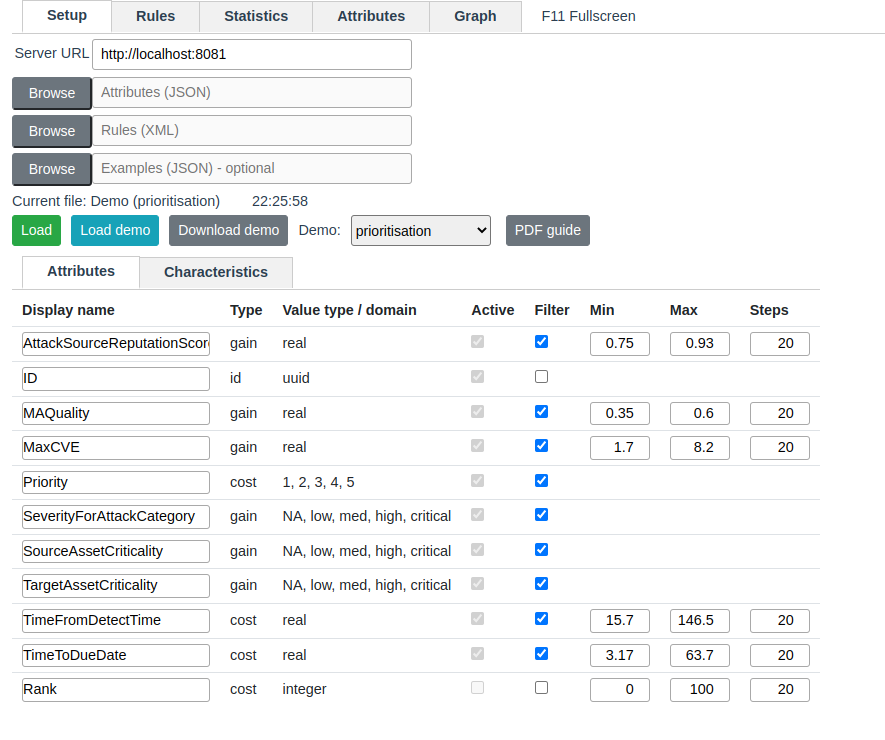
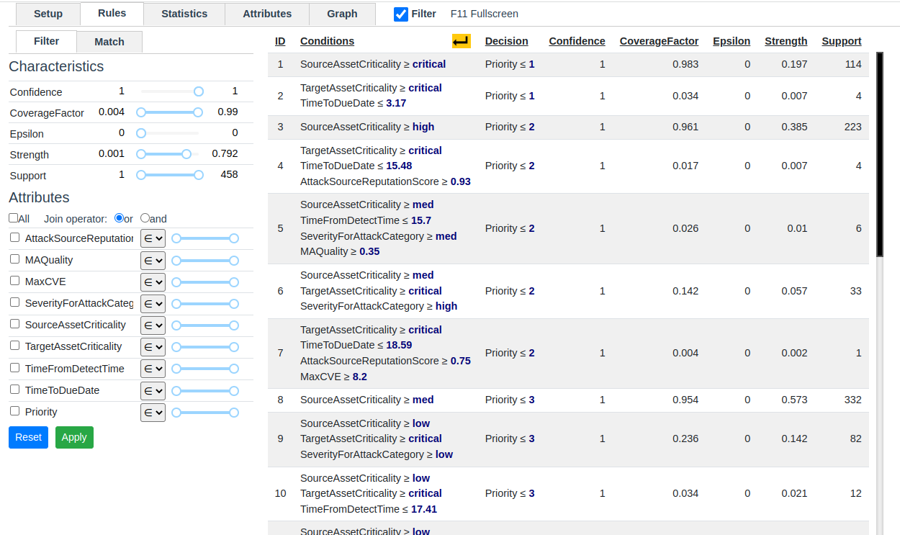
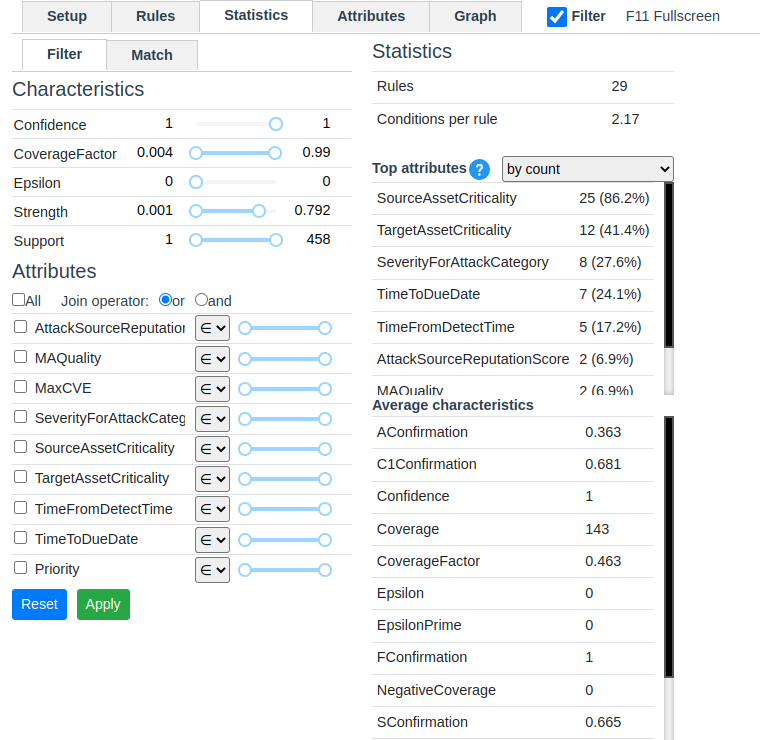
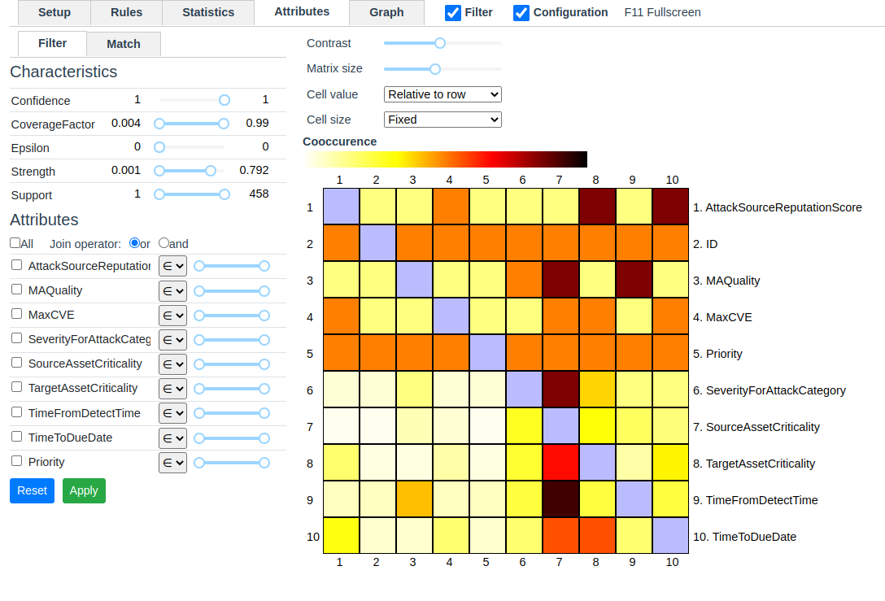
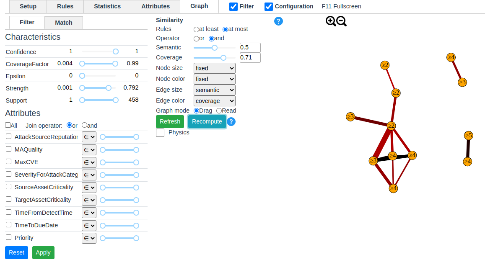

# rule-visualization-frontend

## Description

Application for visualization of decision rules:
- Setup and attributes preview
- Rules explorer
- Statistics
- Rules correlations (matrix)
- Rules correlations (graph)

See screenshots below.

## Development

### Backend - source code
Application requires working backend application. 
You can download backend application (source code) [here](https://github.com/matlewan/rule-visualization-backend). 
You can find instructions for running backend app in link above.

### Installation
`npm run install`

### Build and run locally
`npm run serve`

### Build for production
`npm run build`

## Screenshots

### Setup and attributes preview

### Rules

### Statistics

### Matrix

### Graph

